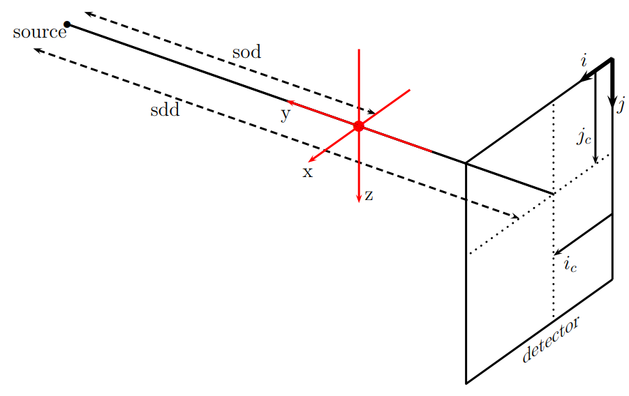

CT Geometries
=============

We shall use the following definitions throughout this section:

.. math::
   \begin{eqnarray*}
   \boldsymbol{\theta} &:=& \boldsymbol{\theta}(\varphi) := \begin{bmatrix} \cos\varphi \\ \sin\varphi \\ 0 \end{bmatrix} \\
   \boldsymbol{\theta}^\perp &:=& \boldsymbol{\theta}^\perp(\varphi) := \begin{bmatrix} -\sin\varphi \\ \cos\varphi \\ 0 \end{bmatrix} \\
   \widehat{\boldsymbol{z}} &:=& \begin{bmatrix} 0 \\ 0 \\ 1 \end{bmatrix}
   \end{eqnarray*}

We shall denote a point is real space (in the reconstruction volume) by any of the following :math:`\boldsymbol{x} = (x_1, x_2, x_3) = (x, y, z)`.
The volume is CT attenuation data are denoted by g and the CT volume by f; these are related by g = Pf, where P is the X-ray Transform.  The detector coordinates are given by

.. math::
   \begin{eqnarray*}
   s[i] &:=& \text{pixelWidth}*(i - \text{centerCol}), \text{ for } i = 0, \dots, \text{numCols}-1, \\
   t[j] &:=& \text{pixelHeight}*(j - \text{centerRow}), \text{ for } j = 0, \dots, \text{numRows}-1.
   \end{eqnarray*}

Below is a sketch of the cone-beam geometry used in LEAP; :math:`i_c` and :math:`j_c` represent the centerCol and centerRow parameters, respectively.

.. autofunction:: leapctype.tomographicModels.setAngleArray
.. autofunction:: leapctype.tomographicModels.set_conebeam
.. autofunction:: leapctype.tomographicModels.set_coneparallel
.. autofunction:: leapctype.tomographicModels.set_fanbeam
.. autofunction:: leapctype.tomographicModels.set_parallelbeam
.. autofunction:: leapctype.tomographicModels.set_modularbeam
.. autofunction:: leapctype.tomographicModels.set_tau
.. autofunction:: leapctype.tomographicModels.set_helicalPitch
.. autofunction:: leapctype.tomographicModels.set_normalizedHelicalPitch
.. autofunction:: leapctype.tomographicModels.get_normalizedHelicalPitch
.. autofunction:: leapctype.tomographicModels.set_flatDetector
.. autofunction:: leapctype.tomographicModels.set_curvedDetector
.. autofunction:: leapctype.tomographicModels.get_detectorType
.. autofunction:: leapctype.tomographicModels.set_centerCol
.. autofunction:: leapctype.tomographicModels.set_centerRow
.. autofunction:: leapctype.tomographicModels.convert_to_modularbeam
.. autofunction:: leapctype.tomographicModels.rotate_detector
.. autofunction:: leapctype.tomographicModels.shift_detector
.. autofunction:: leapctype.tomographicModels.rotate_coordinate_system
.. autofunction:: leapctype.tomographicModels.find_centerCol
.. autofunction:: leapctype.tomographicModels.find_tau
.. autofunction:: leapctype.tomographicModels.estimate_tilt
.. autofunction:: leapctype.tomographicModels.conjugate_difference
.. autofunction:: leapctype.tomographicModels.consistency_cost
.. autofunction:: leapctype.tomographicModels.rebin_parallel_sinogram
