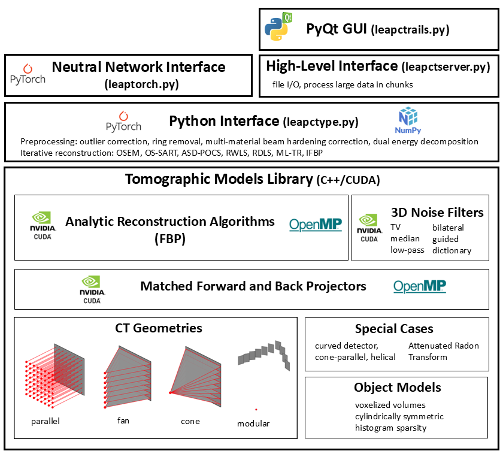

.. LEAP documentation master file, created by
   sphinx-quickstart on Mon Feb 19 08:38:34 2024.
   You can adapt this file completely to your liking, but it should at least
   contain the root `toctree` directive.

LivermorE AI Projector for Computed Tomography |LEAPiconImage|
==============================================================

LEAP is a C++/CUDA library (Linux, Windows, and Mac) of 3D tomographic algorithms (pre-processing algorithms, projectors, and analytic (FBP) and iterative reconstruction algorithms) with a Python interface. The projectors (forward and back projection) are implemented for both multi-GPU and multi-core CPU and we provide bindings to PyTorch to achieve differentiable forward and backward projectors for AI/ML-driven Computed Tomography (CT) applications.

.. toctree::
   :maxdepth: 2
   :caption: Contents:

   install
   Technical Manual <https://github.com/LLNL/LEAP/blob/main/documentation/LEAP.pdf>
   leapctype
   preprocessing_algorithms
   physics_based_preprocessing_algorithms
   leaptorch
   
   

Indices and tables
==================

* :ref:`genindex`
* :ref:`modindex`
* :ref:`search`
